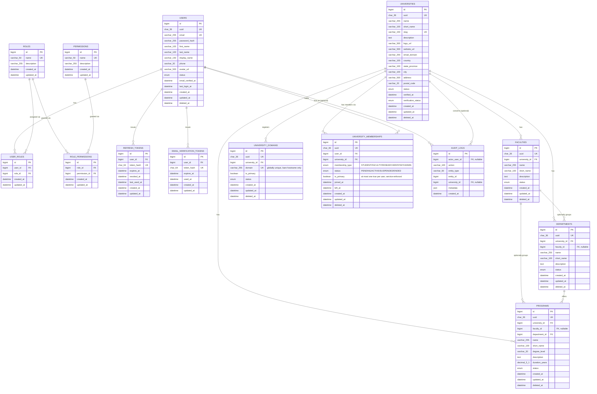

# Database ERD — Chunks 02–04 (Identity, Institution, RBAC, Auth Tokens & University Management)

This diagram covers only the tables implemented so far. See
[`database-guidelines.md`](./database-guidelines.md) for the domains
planned for later chunks, [`authentication.md`](./authentication.md) for
how the RBAC and token tables are used, and
[`university-management.md`](./university-management.md) for how the
Chunk 04 tables (`university_domains`, `university_memberships`,
`audit_logs`) are used.

## Reading this diagram

- `USERS ↔ ROLES` is many-to-many through `USER_ROLES` — a user can hold
  several roles (e.g. `FACULTY` and `UNIVERSITY_ADMIN`) at once.
- `ROLES ↔ PERMISSIONS` is many-to-many through `ROLE_PERMISSIONS` — the
  RBAC layer. A user's effective permissions are the union of every
  permission granted to every role they hold (see
  [`authentication.md`](./authentication.md) §9).
- `USERS → REFRESH_TOKENS` and `USERS → EMAIL_VERIFICATION_TOKENS` are
  one-to-many: a user accumulates a history of issued tokens over time
  (refresh tokens rotate on use — see `authentication.md` §6 — and each
  rotation is a new row, with the old one marked `revoked_at`). Both
  tables store only a SHA-256 hash of the actual token, never the raw
  value (`authentication.md` §6, `database-guidelines.md` "Token
  Hashing").
- `UNIVERSITIES` is the root of the institution hierarchy. `FACULTIES`
  and `DEPARTMENTS` both carry a direct `university_id`, not just a
  transitive one through each other — this is deliberate, since
  `faculty_id` on `DEPARTMENTS` (and on `PROGRAMS`) is optional. An
  institution without a faculty layer still has departments correctly
  scoped to their university.
- `PROGRAMS` always has a `department_id`, and carries `university_id`
  (and optionally `faculty_id`) directly for the same reason — querying
  "all programs at university X" should never require walking through an
  optional faculty relationship.
- `UNIVERSITY_DOMAINS` (Chunk 04) is one-to-many from `UNIVERSITIES`, but
  `domain` is **globally** unique across the whole table, not just within
  a university — a DNS domain can only ever belong to one institution.
- `UNIVERSITY_MEMBERSHIPS` (Chunk 04) is the many-to-many join between
  `USERS` and `UNIVERSITIES`, carrying a `membership_type` and `status` —
  this is deliberately **not** the same relationship as `USERS ↔ ROLES`.
  A role (`UNIVERSITY_ADMIN`) is a global platform capability; a
  membership is *which* university and *in what capacity*. The two are
  checked together only by the university-scoped authorization service,
  never inferred from one another — see
  [`university-management.md`](./university-management.md) §2 and §8. A
  user may hold several memberships (even across several universities),
  but at most one may have `is_primary = true` at a time, enforced at the
  service layer rather than by a DB constraint (MySQL has no
  partial/filtered unique index).
- `AUDIT_LOGS` (Chunk 04) optionally references both `USERS`
  (`actor_user_id`) and `UNIVERSITIES` (`university_id`) — both nullable,
  both `ON DELETE SET NULL`, since an audit entry must survive the
  removal of the thing it references. It is never addressed by its own
  `id` from any API endpoint (queried only by `entity_type`/`entity_id`,
  `university_id`, or `actor_user_id`), so it has no `uuid` column.

Full column types, constraints, indexes, and `ON DELETE` behavior are in
[`../database/schema.sql`](../database/schema.sql) and explained in
[`database-guidelines.md`](./database-guidelines.md).
