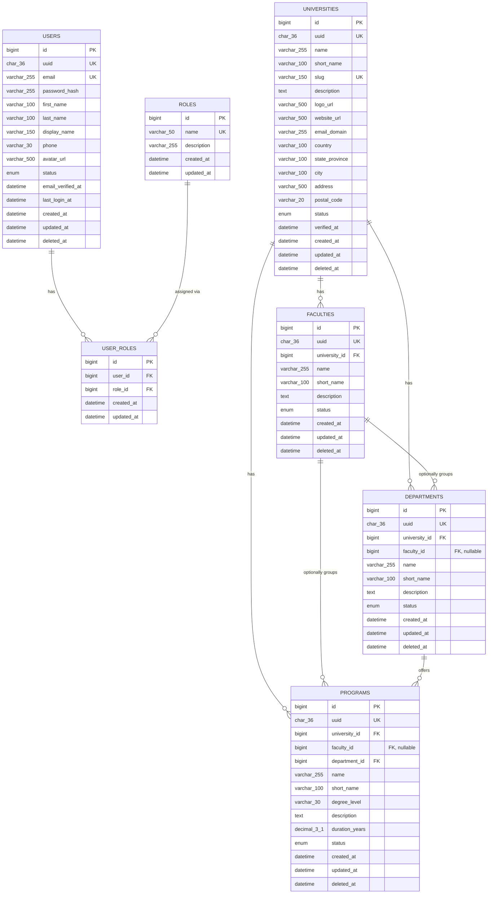

# Database ERD — Chunk 02 (Identity & Institution)

This diagram covers only the tables implemented so far. See
[`database-guidelines.md`](./database-guidelines.md) for the domains
planned for later chunks.

## Reading this diagram

- `USERS ↔ ROLES` is many-to-many through `USER_ROLES` — a user can hold
  several roles (e.g. `FACULTY` and `UNIVERSITY_ADMIN`) at once.
- `UNIVERSITIES` is the root of the institution hierarchy. `FACULTIES`
  and `DEPARTMENTS` both carry a direct `university_id`, not just a
  transitive one through each other — this is deliberate, since
  `faculty_id` on `DEPARTMENTS` (and on `PROGRAMS`) is optional. An
  institution without a faculty layer still has departments correctly
  scoped to their university.
- `PROGRAMS` always has a `department_id`, and carries `university_id`
  (and optionally `faculty_id`) directly for the same reason — querying
  "all programs at university X" should never require walking through an
  optional faculty relationship.

Full column types, constraints, indexes, and `ON DELETE` behavior are in
[`../database/schema.sql`](../database/schema.sql) and explained in
[`database-guidelines.md`](./database-guidelines.md).
