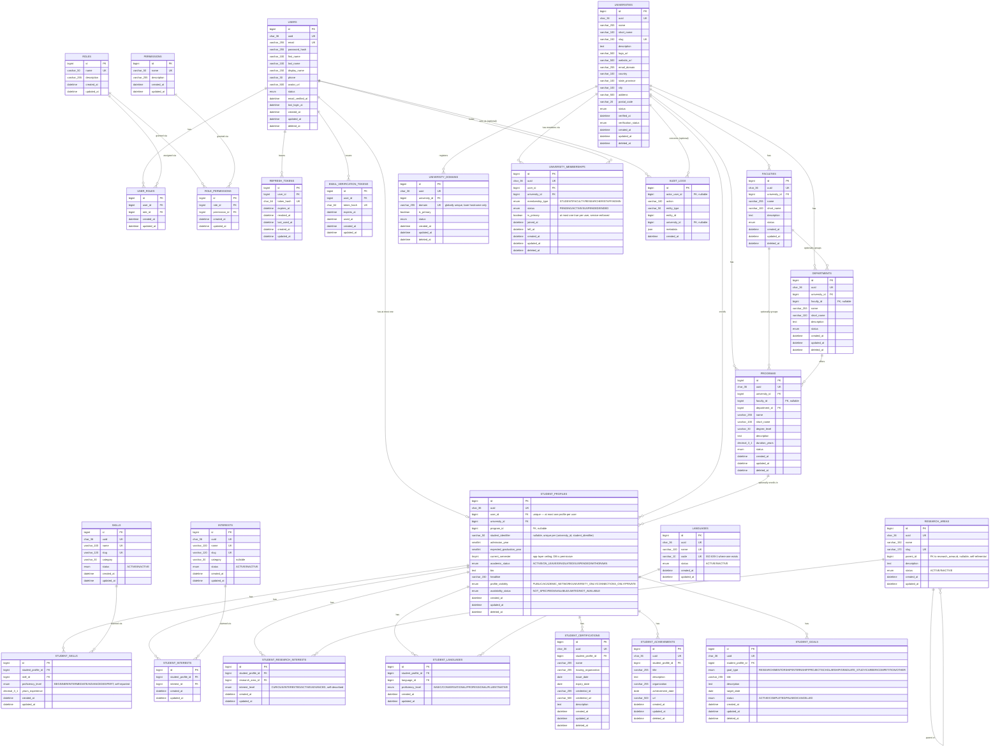

# Database ERD — Chunks 02–05 (Identity, Institution, RBAC, Auth Tokens, University Management & Student Profiles)

This diagram covers only the tables implemented so far. See
[`database-guidelines.md`](./database-guidelines.md) for the domains
planned for later chunks, [`authentication.md`](./authentication.md) for
how the RBAC and token tables are used,
[`university-management.md`](./university-management.md) for how the
Chunk 04 tables (`university_domains`, `university_memberships`,
`audit_logs`) are used, and
[`student-profiles.md`](./student-profiles.md) for how the Chunk 05
tables (`student_profiles` and everything hanging off it) are used.

```mermaid
erDiagram
    USERS ||--o{ USER_ROLES : "has"
    ROLES ||--o{ USER_ROLES : "assigned via"
    ROLES ||--o{ ROLE_PERMISSIONS : "granted via"
    PERMISSIONS ||--o{ ROLE_PERMISSIONS : "granted via"
    USERS ||--o{ REFRESH_TOKENS : "issues"
    USERS ||--o{ EMAIL_VERIFICATION_TOKENS : "issues"

    UNIVERSITIES ||--o{ FACULTIES : "has"
    UNIVERSITIES ||--o{ DEPARTMENTS : "has"
    UNIVERSITIES ||--o{ PROGRAMS : "has"
    FACULTIES ||--o{ DEPARTMENTS : "optionally groups"
    FACULTIES ||--o{ PROGRAMS : "optionally groups"
    DEPARTMENTS ||--o{ PROGRAMS : "offers"

    UNIVERSITIES ||--o{ UNIVERSITY_DOMAINS : "registers"
    UNIVERSITIES ||--o{ UNIVERSITY_MEMBERSHIPS : "has members via"
    USERS ||--o{ UNIVERSITY_MEMBERSHIPS : "holds"
    USERS ||--o{ AUDIT_LOGS : "acts as (optional)"
    UNIVERSITIES ||--o{ AUDIT_LOGS : "concerns (optional)"

    USERS ||--o| STUDENT_PROFILES : "has at most one"
    UNIVERSITIES ||--o{ STUDENT_PROFILES : "enrolls"
    PROGRAMS ||--o{ STUDENT_PROFILES : "optionally enrolls in"

    STUDENT_PROFILES ||--o{ STUDENT_SKILLS : "has"
    SKILLS ||--o{ STUDENT_SKILLS : "claimed via"
    STUDENT_PROFILES ||--o{ STUDENT_INTERESTS : "has"
    INTERESTS ||--o{ STUDENT_INTERESTS : "claimed via"
    STUDENT_PROFILES ||--o{ STUDENT_RESEARCH_INTERESTS : "has"
    RESEARCH_AREAS ||--o{ STUDENT_RESEARCH_INTERESTS : "claimed via"
    RESEARCH_AREAS ||--o{ RESEARCH_AREAS : "parent of"
    STUDENT_PROFILES ||--o{ STUDENT_LANGUAGES : "has"
    LANGUAGES ||--o{ STUDENT_LANGUAGES : "claimed via"
    STUDENT_PROFILES ||--o{ STUDENT_CERTIFICATIONS : "has"
    STUDENT_PROFILES ||--o{ STUDENT_ACHIEVEMENTS : "has"
    STUDENT_PROFILES ||--o{ STUDENT_GOALS : "has"

    USERS {
        bigint id PK
        char_36 uuid UK
        varchar_255 email UK
        varchar_255 password_hash
        varchar_100 first_name
        varchar_100 last_name
        varchar_150 display_name
        varchar_30 phone
        varchar_500 avatar_url
        enum status
        datetime email_verified_at
        datetime last_login_at
        datetime created_at
        datetime updated_at
        datetime deleted_at
    }

    ROLES {
        bigint id PK
        varchar_50 name UK
        varchar_255 description
        datetime created_at
        datetime updated_at
    }

    USER_ROLES {
        bigint id PK
        bigint user_id FK
        bigint role_id FK
        datetime created_at
        datetime updated_at
    }

    PERMISSIONS {
        bigint id PK
        varchar_50 name UK
        varchar_255 description
        datetime created_at
        datetime updated_at
    }

    ROLE_PERMISSIONS {
        bigint id PK
        bigint role_id FK
        bigint permission_id FK
        datetime created_at
        datetime updated_at
    }

    REFRESH_TOKENS {
        bigint id PK
        bigint user_id FK
        char_64 token_hash UK
        datetime expires_at
        datetime revoked_at
        datetime last_used_at
        datetime created_at
        datetime updated_at
    }

    EMAIL_VERIFICATION_TOKENS {
        bigint id PK
        bigint user_id FK
        char_64 token_hash UK
        datetime expires_at
        datetime used_at
        datetime created_at
        datetime updated_at
    }

    UNIVERSITIES {
        bigint id PK
        char_36 uuid UK
        varchar_255 name
        varchar_100 short_name
        varchar_150 slug UK
        text description
        varchar_500 logo_url
        varchar_500 website_url
        varchar_255 email_domain
        varchar_100 country
        varchar_100 state_province
        varchar_100 city
        varchar_500 address
        varchar_20 postal_code
        enum status
        datetime verified_at
        enum verification_status
        datetime created_at
        datetime updated_at
        datetime deleted_at
    }

    FACULTIES {
        bigint id PK
        char_36 uuid UK
        bigint university_id FK
        varchar_255 name
        varchar_100 short_name
        text description
        enum status
        datetime created_at
        datetime updated_at
        datetime deleted_at
    }

    DEPARTMENTS {
        bigint id PK
        char_36 uuid UK
        bigint university_id FK
        bigint faculty_id "FK, nullable"
        varchar_255 name
        varchar_100 short_name
        text description
        enum status
        datetime created_at
        datetime updated_at
        datetime deleted_at
    }

    PROGRAMS {
        bigint id PK
        char_36 uuid UK
        bigint university_id FK
        bigint faculty_id "FK, nullable"
        bigint department_id FK
        varchar_255 name
        varchar_100 short_name
        varchar_30 degree_level
        text description
        decimal_3_1 duration_years
        enum status
        datetime created_at
        datetime updated_at
        datetime deleted_at
    }

    UNIVERSITY_DOMAINS {
        bigint id PK
        char_36 uuid UK
        bigint university_id FK
        varchar_255 domain UK "globally unique, bare hostname only"
        boolean is_primary
        enum status
        datetime created_at
        datetime updated_at
        datetime deleted_at
    }

    UNIVERSITY_MEMBERSHIPS {
        bigint id PK
        char_36 uuid UK
        bigint user_id FK
        bigint university_id FK
        enum membership_type "STUDENT/FACULTY/RESEARCHER/STAFF/ADMIN"
        enum status "PENDING/ACTIVE/SUSPENDED/ENDED"
        boolean is_primary "at most one true per user, service-enforced"
        datetime joined_at
        datetime left_at
        datetime created_at
        datetime updated_at
        datetime deleted_at
    }

    AUDIT_LOGS {
        bigint id PK
        bigint actor_user_id "FK, nullable"
        varchar_100 action
        varchar_50 entity_type
        bigint entity_id
        bigint university_id "FK, nullable"
        json metadata
        datetime created_at
    }

    STUDENT_PROFILES {
        bigint id PK
        char_36 uuid UK
        bigint user_id FK "unique — at most one profile per user"
        bigint university_id FK
        bigint program_id "FK, nullable"
        varchar_50 student_identifier "nullable, unique per (university_id, student_identifier)"
        smallint admission_year
        smallint expected_graduation_year
        tinyint current_semester "app-layer ceiling; DB is permissive"
        enum academic_status "ACTIVE/ON_LEAVE/GRADUATED/SUSPENDED/WITHDRAWN"
        text bio
        varchar_150 headline
        enum profile_visibility "PUBLIC/ACADEMIC_NETWORK/UNIVERSITY_ONLY/CONNECTIONS_ONLY/PRIVATE"
        enum availability_status "NOT_SPECIFIED/AVAILABLE/LIMITED/NOT_AVAILABLE"
        datetime created_at
        datetime updated_at
        datetime deleted_at
    }

    SKILLS {
        bigint id PK
        char_36 uuid UK
        varchar_100 name UK
        varchar_120 slug UK
        varchar_30 category
        enum status "ACTIVE/INACTIVE"
        datetime created_at
        datetime updated_at
    }

    STUDENT_SKILLS {
        bigint id PK
        bigint student_profile_id FK
        bigint skill_id FK
        enum proficiency_level "BEGINNER/INTERMEDIATE/ADVANCED/EXPERT, self-reported"
        decimal_3_1 years_experience
        datetime created_at
        datetime updated_at
    }

    INTERESTS {
        bigint id PK
        char_36 uuid UK
        varchar_100 name UK
        varchar_120 slug UK
        varchar_30 category "nullable"
        enum status "ACTIVE/INACTIVE"
        datetime created_at
        datetime updated_at
    }

    STUDENT_INTERESTS {
        bigint id PK
        bigint student_profile_id FK
        bigint interest_id FK
        datetime created_at
        datetime updated_at
    }

    RESEARCH_AREAS {
        bigint id PK
        char_36 uuid UK
        varchar_150 name
        varchar_170 slug UK
        bigint parent_id "FK to research_areas.id, nullable, self-referential"
        text description
        enum status "ACTIVE/INACTIVE"
        datetime created_at
        datetime updated_at
    }

    STUDENT_RESEARCH_INTERESTS {
        bigint id PK
        bigint student_profile_id FK
        bigint research_area_id FK
        enum interest_level "CURIOUS/INTERESTED/ACTIVE/ADVANCED, self-described"
        datetime created_at
        datetime updated_at
    }

    LANGUAGES {
        bigint id PK
        char_36 uuid UK
        varchar_100 name UK
        varchar_10 code UK "ISO 639-1 where one exists"
        enum status "ACTIVE/INACTIVE"
        datetime created_at
        datetime updated_at
    }

    STUDENT_LANGUAGES {
        bigint id PK
        bigint student_profile_id FK
        bigint language_id FK
        enum proficiency_level "BASIC/CONVERSATIONAL/PROFESSIONAL/FLUENT/NATIVE"
        datetime created_at
        datetime updated_at
    }

    STUDENT_CERTIFICATIONS {
        bigint id PK
        char_36 uuid UK
        bigint student_profile_id FK
        varchar_255 name
        varchar_255 issuing_organization
        date issue_date
        date expiry_date
        varchar_255 credential_id
        varchar_500 credential_url
        text description
        datetime created_at
        datetime updated_at
        datetime deleted_at
    }

    STUDENT_ACHIEVEMENTS {
        bigint id PK
        char_36 uuid UK
        bigint student_profile_id FK
        varchar_255 title
        text description
        varchar_255 organization
        date achievement_date
        varchar_500 url
        datetime created_at
        datetime updated_at
        datetime deleted_at
    }

    STUDENT_GOALS {
        bigint id PK
        char_36 uuid UK
        bigint student_profile_id FK
        enum goal_type "RESEARCH/MENTORSHIP/INTERNSHIP/PROJECT/SCHOLARSHIP/GRADUATE_STUDY/CAREER/COMPETITION/OTHER"
        varchar_255 title
        text description
        date target_date
        enum status "ACTIVE/COMPLETED/PAUSED/CANCELLED"
        datetime created_at
        datetime updated_at
        datetime deleted_at
    }
```

## Reading this diagram

- `USERS ↔ ROLES` is many-to-many through `USER_ROLES` — a user can hold
  several roles (e.g. `FACULTY` and `UNIVERSITY_ADMIN`) at once.
- `ROLES ↔ PERMISSIONS` is many-to-many through `ROLE_PERMISSIONS` — the
  RBAC layer. A user's effective permissions are the union of every
  permission granted to every role they hold (see
  [`authentication.md`](./authentication.md) §9).
- `USERS → REFRESH_TOKENS` and `USERS → EMAIL_VERIFICATION_TOKENS` are
  one-to-many: a user accumulates a history of issued tokens over time
  (refresh tokens rotate on use — see `authentication.md` §6 — and each
  rotation is a new row, with the old one marked `revoked_at`). Both
  tables store only a SHA-256 hash of the actual token, never the raw
  value (`authentication.md` §6, `database-guidelines.md` "Token
  Hashing").
- `UNIVERSITIES` is the root of the institution hierarchy. `FACULTIES`
  and `DEPARTMENTS` both carry a direct `university_id`, not just a
  transitive one through each other — this is deliberate, since
  `faculty_id` on `DEPARTMENTS` (and on `PROGRAMS`) is optional. An
  institution without a faculty layer still has departments correctly
  scoped to their university.
- `PROGRAMS` always has a `department_id`, and carries `university_id`
  (and optionally `faculty_id`) directly for the same reason — querying
  "all programs at university X" should never require walking through an
  optional faculty relationship.
- `UNIVERSITY_DOMAINS` (Chunk 04) is one-to-many from `UNIVERSITIES`, but
  `domain` is **globally** unique across the whole table, not just within
  a university — a DNS domain can only ever belong to one institution.
- `UNIVERSITY_MEMBERSHIPS` (Chunk 04) is the many-to-many join between
  `USERS` and `UNIVERSITIES`, carrying a `membership_type` and `status` —
  this is deliberately **not** the same relationship as `USERS ↔ ROLES`.
  A role (`UNIVERSITY_ADMIN`) is a global platform capability; a
  membership is *which* university and *in what capacity*. The two are
  checked together only by the university-scoped authorization service,
  never inferred from one another — see
  [`university-management.md`](./university-management.md) §2 and §8. A
  user may hold several memberships (even across several universities),
  but at most one may have `is_primary = true` at a time, enforced at the
  service layer rather than by a DB constraint (MySQL has no
  partial/filtered unique index).
- `AUDIT_LOGS` (Chunk 04) optionally references both `USERS`
  (`actor_user_id`) and `UNIVERSITIES` (`university_id`) — both nullable,
  both `ON DELETE SET NULL`, since an audit entry must survive the
  removal of the thing it references. It is never addressed by its own
  `id` from any API endpoint (queried only by `entity_type`/`entity_id`,
  `university_id`, or `actor_user_id`), so it has no `uuid` column.
- `STUDENT_PROFILES` (Chunk 05) is deliberately **not** the same
  relationship as `USERS ↔ UNIVERSITY_MEMBERSHIPS` — a membership is the
  authoritative institutional-affiliation record (Chunk 04); a student
  profile is the academic-identity detail (program, semester, bio,
  visibility, ...) that belongs to neither `USERS` nor
  `UNIVERSITY_MEMBERSHIPS`. `USERS ||--o| STUDENT_PROFILES` is one-to-
  *at-most-one* (`user_id` is unique) — see
  [`student-profiles.md`](./student-profiles.md) §3 for the known
  limitation this simplicity leaves for a future delete/recreate flow.
  `PROGRAM_ID` is optional; a student without a declared major is valid.
- `SKILLS`, `INTERESTS`, `RESEARCH_AREAS`, and `LANGUAGES` are reusable,
  platform-wide catalogs — never comma-separated text on the profile
  itself. Each has a matching `STUDENT_*` join table
  (`STUDENT_SKILLS`, `STUDENT_INTERESTS`, `STUDENT_RESEARCH_INTERESTS`,
  `STUDENT_LANGUAGES`), each enforcing a unique
  `(student_profile_id, catalog_id)` pair at the database level — a
  duplicate add is rejected by the schema itself, not only application
  logic. Unlike `ROLES`/`PERMISSIONS` (addressed by `name`), these four
  catalogs carry a `uuid`, because the API addresses them directly from
  a URL (`/api/students/me/skills/:skillId`, etc.) — see
  `database-guidelines.md` §4 for the general rule.
- `RESEARCH_AREAS` is self-referential (`parent_id`) to express a
  hierarchy (Artificial Intelligence → Machine Learning → Deep Learning);
  `SET NULL` on a parent's removal mirrors the `FACULTIES → DEPARTMENTS`
  precedent (an optional parent reference clears rather than blocks or
  cascades).
- `STUDENT_CERTIFICATIONS`, `STUDENT_ACHIEVEMENTS`, and `STUDENT_GOALS`
  are standalone records (each addressed by its own `uuid` from a URL),
  unlike the join tables above — so, consistent with every other
  externally-addressable entity in this schema, each is `paranoid`
  (soft-deleted) and carries its own `uuid`.

Full column types, constraints, indexes, and `ON DELETE` behavior are in
[`../database/schema.sql`](../database/schema.sql) and explained in
[`database-guidelines.md`](./database-guidelines.md).
